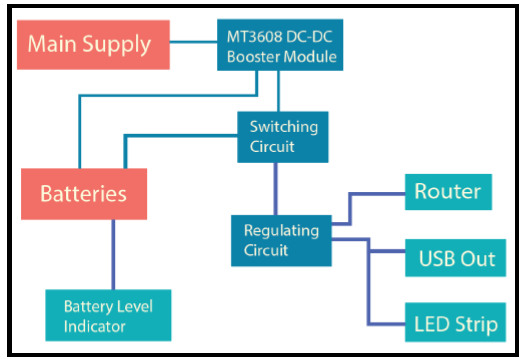
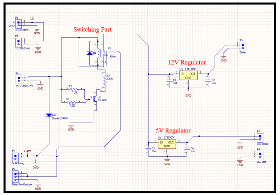
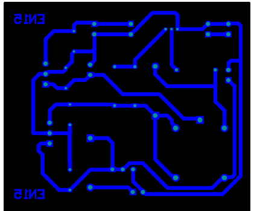
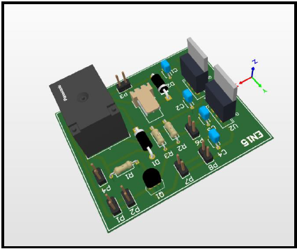
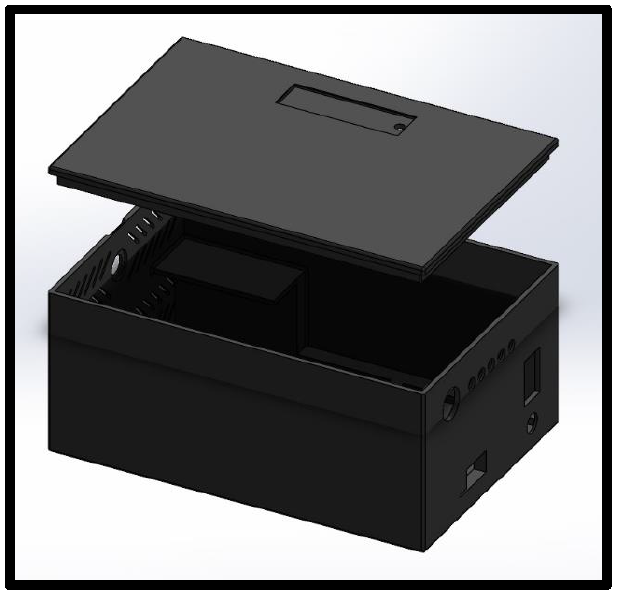
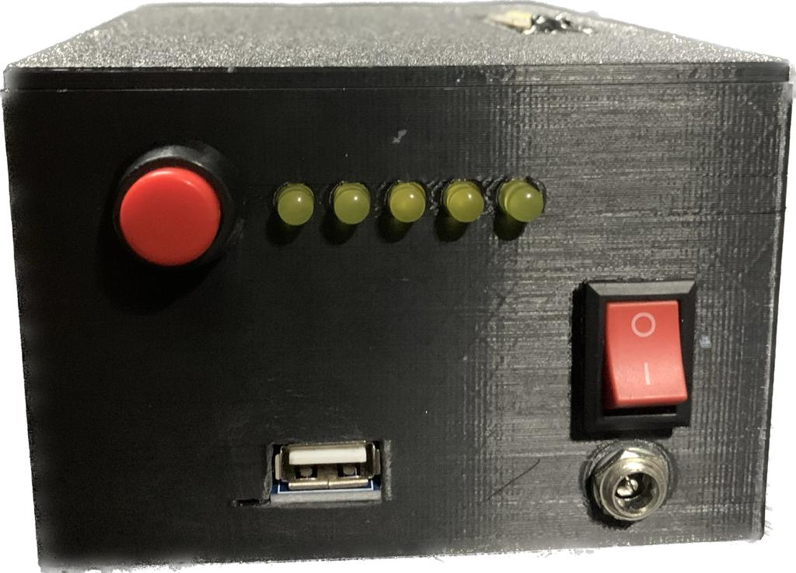

# Automated-Power-Backup
This repository contains the project details for "Automated Power Backup", developed as part of the Semester 2 EN1190 Electronic Design Project module. 
The automated power backup provides an uninterrupted power to the Wi-Fi routers, so that users can experience a continuous internet connection even during the prevailing government-imposed blackouts along with the additional features of portable power bank, emergency lamp and users can be aware about the power remaining in the backup through the battery level indicator too.
## Product Architecure 
Our design mainly contains the following blocks. This has aimed at mainly 3 things. Automated switching between the main power supply and backup power supply, regulating voltages to get the outputs 5V & 12V, and stepping up the voltages to get the required voltages to feed into the particular stages.

  

## Schematics and PCB Layouts

  
  
  

## Enclosure Design

  
  

